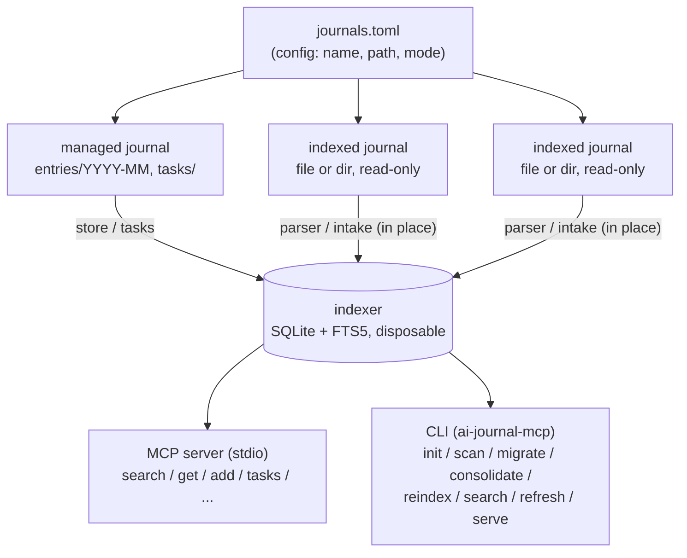
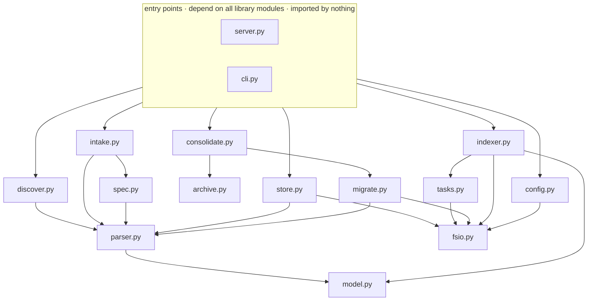
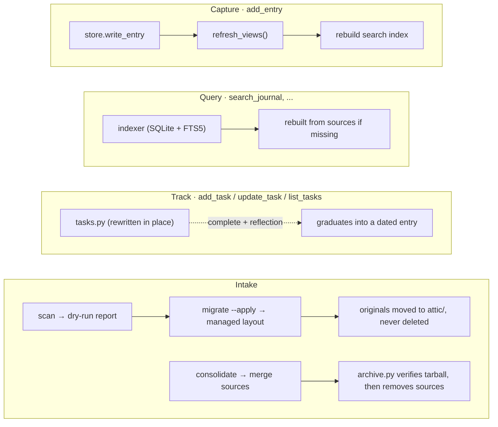

# Architecture

ai-journal-mcp turns plain-markdown work journals into a queryable system without
taking ownership of the data away from the user. This document describes the
components and how data flows through them. For the rationale behind these
choices, see `ARCHITECTURE_DECISIONS.md`; for exact formats, see
`SPECIFICATION.md`.

## System Overview

## Components

| Module | Responsibility |
|--------|----------------|
| `model.py` | `Entry` dataclass, slugs, duplicate-identity hashing |
| `parser.py` | Extract dated entries from heterogeneous markdown; filename-date fallback for archive eras |
| `discover.py` | Read-only evidence report about an unfamiliar journal: file-name patterns, heading shapes, frontmatter keys, excerpts |
| `spec.py` | Extraction specs: LLM-proposed TOML rules for foreign formats, validated and executed deterministically |
| `intake.py` | Read-only scan of an existing journal: counts, date ranges, duplicates, orphans (`IntakeReport`); spec-driven walk for foreign layouts |
| `migrate.py` | Apply a migration (messy → managed layout); regenerate views (`refresh_views`) |
| `consolidate.py` | Merge several sources into one fresh managed journal; sources archived then removed |
| `archive.py` | Tar-and-verify safety net for consolidation: sources are deleted only after every file is confirmed inside the archive |
| `store.py` | Managed-journal I/O: load entries with frontmatter, write new entries, `load_source` dispatch |
| `tasks.py` | The mutable task kind: create/update/list under `tasks/`, readiness from `blocked_by`, graduation into entries |
| `indexer.py` | Build/query the SQLite FTS5 index: `search`, `list_themes`, `entries_over_time`, staleness signatures |
| `fsio.py` | Concurrency primitives every writer uses: atomic replace, exclusive create, per-journal lock |
| `config.py` | `journals.toml` loading; default config/db paths |
| `server.py` | MCP stdio server — thin layer over the library |
| `cli.py` | Command-line entry points — thin layer over the library |

Dependency direction: `server.py` and `cli.py` depend on everything;
library modules depend only downward (`consolidate` → `archive`/`migrate`;
`store`/`intake`/`migrate` → `parser` → `model`; `intake` → `spec` →
`parser`; `discover` → `parser`; `indexer` → `model`/`tasks`;
writers → `fsio`). Nothing imports `server.py` or `cli.py`.

## Journal Modes

- **managed** — ai-journal-mcp owns the layout: one entry per file under
  `entries/YYYY-MM/`, one task per file under `tasks/`, YAML frontmatter,
  generated index (`JOURNAL.md`) and per-theme views (`themes/*.md`), plus a
  `.lock` file used to serialize writers. Writes happen only through
  `store.write_entry` / `tasks.py` (or migration).
- **indexed** — read-only. Entries are parsed in place (any of the supported
  header formats) and appear in cross-journal queries. The files are never
  modified or restructured. For journals with their own working conventions.

## Data Flow: the Four Paths

**Capture** (`add_entry` tool → `store.write_entry`): writes a canonical entry
file, then `migrate.refresh_views()` regenerates the index/theme views, then
the search index is rebuilt. One call leaves everything consistent.

**Query** (`search_journal` etc. → `indexer`): tools hit only the SQLite
index. If the index is missing it is rebuilt from sources on first use; it
can be deleted at any time without losing anything.

**Track** (`add_task`/`update_task`/`list_tasks` → `tasks.py`): the mutable
kind. Tasks live under `tasks/`, are rewritten in place on update, and are
indexed alongside entries so search spans both. Completing a task with a
`reflection` *graduates* it into a dated journal entry — the one bridge
between the mutable and append-only kinds.

**Intake** (`scan` → report; `migrate --apply` → managed layout;
`consolidate --from ... dest` → several sources merged into a fresh managed
journal): scan is always read-only and produces the dry-run report. Apply
moves every original file into `attic/` preserving relative paths, then
writes canonical entries, deduplicates (longest body wins, themes merged),
sweeps emptied directories, and writes `migration-report.md` recording every
dedup decision. Consolidation is the one path that removes source
directories — and only after `archive.py` has verified every file into a
tarball.

For journals in formats the default parser doesn't know, intake becomes a
loop driven by the LLM operating the MCP server: `discover` collects
read-only evidence (file-name patterns, heading shapes, excerpts), the LLM
proposes an **extraction spec** (`spec.py`: globs plus date/time/title
rules), `scan --spec` dry-runs it until every file is accounted for, and
`migrate --spec --apply` executes it deterministically — the LLM decides
where entries are and how they're shaped; code does the verbatim slicing.
The spec is throwaway: recorded in `migration-report.md`, never config.

## Concurrency

Several MCP sessions (each its own process) plus the CLI can touch the same
journal simultaneously. Safety is by construction, in `fsio.py`:

- **Atomic replace** — entries, tasks, views, `journals.toml`, and the index
  are written to a temp file and `os.replace`d, so readers (and crashes) see
  old bytes or new bytes, never a truncated file.
- **Exclusive create** — a new entry file is claimed atomically; two sessions
  writing the same date+title land in two files instead of one overwriting
  the other.
- **Per-journal lock** — an flock on `<root>/.lock` serializes
  read-modify-write sequences (task updates, view regeneration), which
  atomicity alone can't protect. POSIX only; on Windows the lock is a no-op.
- **Index swaps, never mutates** — a rebuild produces a complete temp
  database and swaps it in; staleness signatures are computed *before*
  loading and stored in the same transaction, so a write racing a rebuild
  reads as stale on the next query rather than being missed.

## Trust Boundaries

- The index database lives outside the journals
  (`~/.local/share/ai-journal-mcp/index.db`) and is never the source of truth.
- `get_entry` refuses paths outside configured journal roots. (For a
  single-*file* journal the allowed root is the file's parent directory, so
  siblings of that file are readable — configure a dedicated directory if
  that matters.)
- Task ids are validated against a slug alphabet before touching the
  filesystem; a path-like id (`../…`) is rejected, never resolved.
- Indexed sources are opened read-only by convention; no code path writes to
  them.
